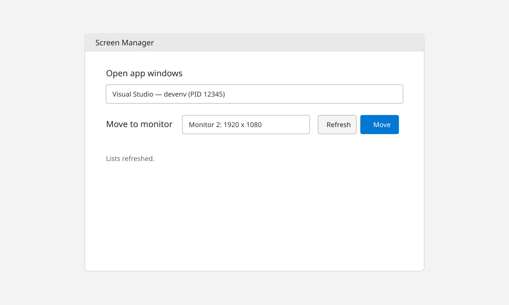
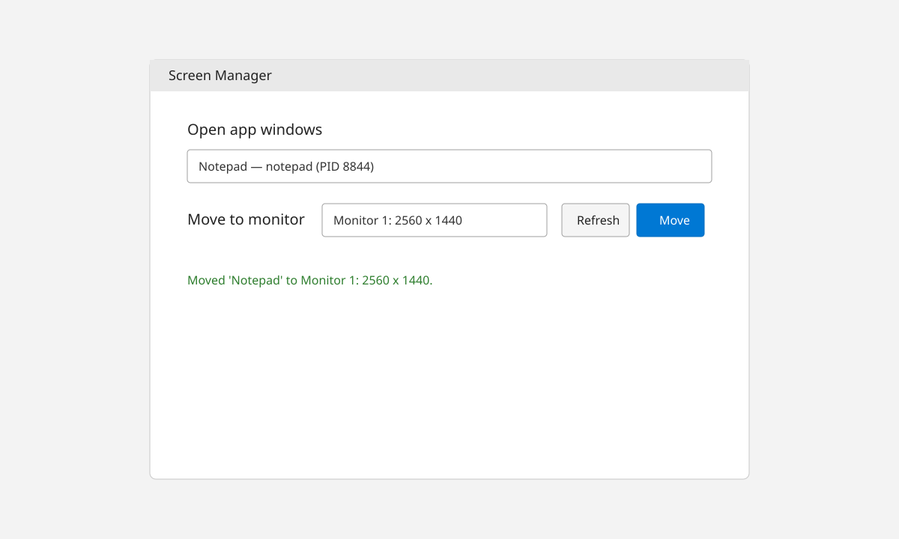

# DeskHop

A minimal **WPF desktop app** for Windows that moves an app window to another monitor.

Built with **.NET 10** and kept intentionally small (YAGNI).

## Features

- Lists open, taskbar-like app windows
- Lists connected monitors
- Moves the selected app window to the selected monitor
- Keeps window placement safe for different monitor work areas
- Small quality-of-life improvements:
  - Refresh after move
  - Keep selections on refresh (when still available)
  - `F5` to refresh, `Enter` to move

## Screenshots

### Main window



### After moving an app



## Requirements

- Windows
- .NET 10 SDK

## Run locally

```powershell
dotnet build
 dotnet run --project .\DeskHop\DeskHop.csproj
```

## Notes

- This tool can only move windows that expose a standard movable top-level window.
- Some system/internal/background processes are intentionally filtered out.
